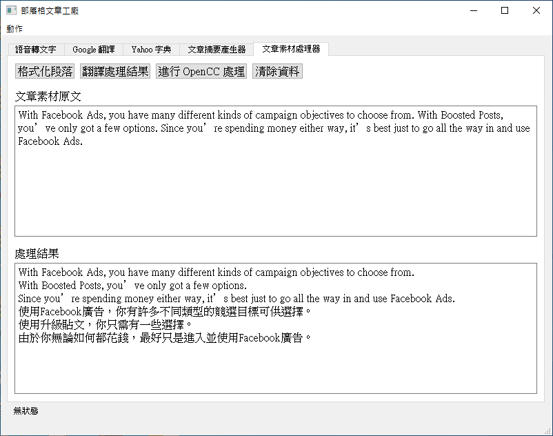

# 部落格文章工廠

我過去有參與過一些行銷方面的案子，其中有一個項目便是內容行銷，也就是透過寫部落格文章的方式來打造出一個能吸引網路流量的平台。

而該案子的行銷人員通常會在網路上尋找各種相關資料(中英文皆有)，然後再將這些資料轉化並編纂成一篇部落格文章。

為了使這些行銷人員在做內容行銷時能夠更有效率，我為他們開發了這個名為「部落格文章工廠」的小工具。

這個小工具是使用 Qt+Python3 所建構而成的，Qt Designer 用於繪製視覺化操作介面，而 Python 則用於連結各個元件並執行各種功能。

該程式具有下列五個主要功能：

 - **語音轉文字：**
使用者可以透過將腦中想法唸出來的方式來寫文章，適合不擅長打字的人或者快速打草稿使用。

 - **剪貼簿自動查詢 Google 翻譯和 Yahoo 字典：**
行銷人員在閱讀英文資料時，只要用 `Ctrl+C` 複製欲查詢之單字，該程式便會自動將複製的單字輸入到 Google 翻譯和 Yahoo 字典裡，省下切換畫面並按下 `Ctrl+V` 的時間。

 - **括號及引用號快捷鍵：**
按下 `Ctrl+=` 以及 `Ctrl+(` 後就能自動在滑鼠游標處插入引用號「」及括號（）。

 - **文章摘要產生器：**
輸入文章摘要以及文章網址後，按下「產生摘要」按鈕就會自動格式化文章摘要內容並產生可用於 WordPress 文章摘要和 Facebook 貼文的文章摘要內容，例如去除多餘空白、在文章摘要末端加上部落格文章連結等。

 - **文章素材處理器：**
輸入一整個段落的英文內容並按下「格式化段落」後，它就會自動根據英文的句點 . 將整個段落分割成一行一個句子，這樣使用者會比較好閱讀並且翻譯出來的結果也會比較容易檢視。
除此之外，若翻譯出來的內容包含簡體中文或中國用語，那麼它也能透過 OpenCC 這個開源的詞彙轉換系統將內容轉換成繁體中文以及台灣用詞。